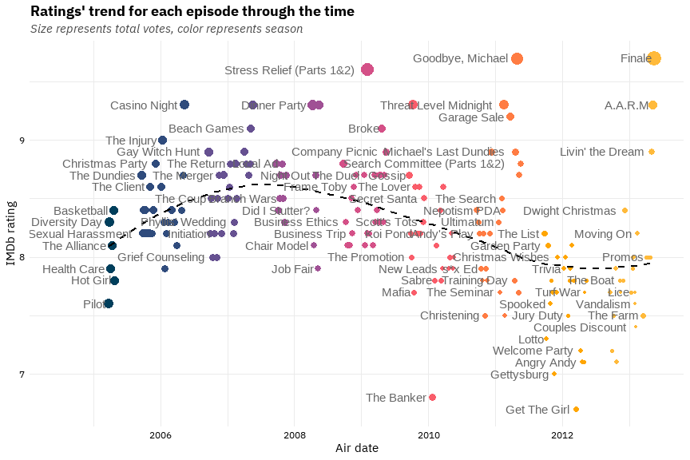

<!-- -->

# [The Office series'](https://www.imdb.com/title/tt0386676/) episodes Exploratory Data Analysis

This is my first project after my Bachelor's Degree in Mathematics. I tried to recall using R and take it a little further. 
click [here](https://github.com/nickschizas/the-office/blob/main/the-office-transcripts.md) to see the analysis.
