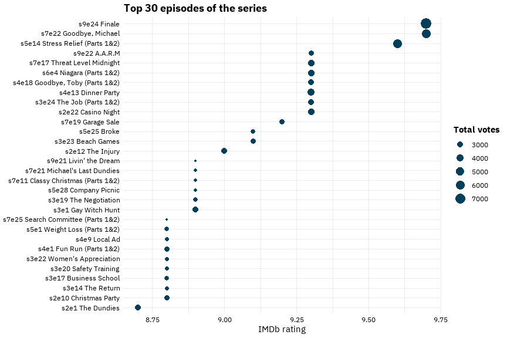

The Office
================

# Abstract

In the following analysis I will try to draw some interesting insights
for [The Office](https://www.imdb.com/title/tt0386676/) series.

</br>

## The data comes from the [tidytuesday](https://github.com/rfordatascience/tidytuesday/blob/master/data/2020/2020-03-17/readme.md)

``` r
office_transcripts <- schrute::theoffice %>%
  mutate(season = as.factor(season),
         character = str_remove_all(character, '"'),
         air_date = as.Date(air_date))

office_transcripts
```

    ## # A tibble: 55,130 x 12
    ##    index season episode episode_name director   writer           character text 
    ##    <int> <fct>    <int> <chr>        <chr>      <chr>            <chr>     <chr>
    ##  1     1 1            1 Pilot        Ken Kwapis Ricky Gervais;S~ Michael   All ~
    ##  2     2 1            1 Pilot        Ken Kwapis Ricky Gervais;S~ Jim       Oh, ~
    ##  3     3 1            1 Pilot        Ken Kwapis Ricky Gervais;S~ Michael   So y~
    ##  4     4 1            1 Pilot        Ken Kwapis Ricky Gervais;S~ Jim       Actu~
    ##  5     5 1            1 Pilot        Ken Kwapis Ricky Gervais;S~ Michael   All ~
    ##  6     6 1            1 Pilot        Ken Kwapis Ricky Gervais;S~ Michael   Yes,~
    ##  7     7 1            1 Pilot        Ken Kwapis Ricky Gervais;S~ Michael   I've~
    ##  8     8 1            1 Pilot        Ken Kwapis Ricky Gervais;S~ Pam       Well~
    ##  9     9 1            1 Pilot        Ken Kwapis Ricky Gervais;S~ Michael   If y~
    ## 10    10 1            1 Pilot        Ken Kwapis Ricky Gervais;S~ Pam       What?
    ## # ... with 55,120 more rows, and 4 more variables: text_w_direction <chr>,
    ## #   imdb_rating <dbl>, total_votes <int>, air_date <date>

</br>

## Create and explore the episodes data

``` r
#Locate the misspellings:
# office_transcripts %>% 
#   distinct(director) %>%
#   arrange(director) %>%
#   view()


episodes <- office_transcripts %>% 
  group_by(season, episode) %>% 
  summarise(air_date = first(air_date),
            episode_name = first(episode_name),
            director = first(director),
            writer = first(writer),
            imdb_rating = first(imdb_rating),
            total_votes = first(total_votes)) %>% 
  mutate(writer = str_replace_all(writer, ";", " & "),
         director = str_replace_all(director, ";", " & ")) %>%
  mutate(director = if_else(director == "Charles McDougal", 
                                "Charles McDougall", director),
         director = if_else(director == "Paul Lieerstein",
                                "Paul Lieberstein", director),
         director = if_else(director == "Claire Scanlong",
                                "Claire Scanlon", director),
         director = if_else(director == "Greg Daneils",
                                "Greg Daniels", director),
         director = if_else(director == "Ken Wittingham",
                                "Ken Whittingham", director)) %>% 
  ungroup()

episodes
```

    ## # A tibble: 186 x 8
    ##    season episode air_date   episode_name      director       writer imdb_rating
    ##    <fct>    <int> <date>     <chr>             <chr>          <chr>        <dbl>
    ##  1 1            1 2005-03-24 Pilot             Ken Kwapis     Ricky~         7.6
    ##  2 1            2 2005-03-29 Diversity Day     Ken Kwapis     B.J. ~         8.3
    ##  3 1            3 2005-04-05 Health Care       Ken Whittingh~ Paul ~         7.9
    ##  4 1            4 2005-04-12 The Alliance      Bryan Gordon   Micha~         8.1
    ##  5 1            5 2005-04-19 Basketball        Greg Daniels   Greg ~         8.4
    ##  6 1            6 2005-04-26 Hot Girl          Amy Heckerling Mindy~         7.8
    ##  7 2            1 2005-09-20 The Dundies       Greg Daniels   Mindy~         8.7
    ##  8 2            2 2005-09-27 Sexual Harassment Ken Kwapis     B.J. ~         8.2
    ##  9 2            3 2005-10-04 Office Olympics   Paul Feig      Micha~         8.4
    ## 10 2            4 2005-10-11 The Fire          Ken Kwapis     B.J. ~         8.4
    ## # ... with 176 more rows, and 1 more variable: total_votes <int>

</br>

``` r
episodes %>% 
  ggplot(aes(season)) +
  geom_bar(fill = col9[1]) +
  labs(title = "Episodes per season",
       y = NULL,
       x = NULL) +
  geom_text(aes(label = ..count..), stat = "count",
            vjust = 1.3, color = "white", fontface = 2) +
  theme(axis.text.y = element_blank())
```

<!-- -->

Most episodes aired on Thursdays.  
The only episode aired on Sunday was the “Stress Relief” episode.

``` r
episodes %>% 
  mutate(dayofweek = lubridate::wday(air_date, label = T, abbr = F, 
                                     locale = "English_United States.1252")) %>%
  ggplot(aes(dayofweek)) +
    geom_bar(fill = col9[1], width = 0.5) +
   geom_text(aes(label = ..count..), stat = "count",
            vjust = -0.4, color = "black", fontface = 2) +
  labs(y = NULL,
       x = NULL) +
  theme(axis.text.y = element_blank())
```

<!-- -->

``` r
episodes %>% 
  mutate(dayofweek = lubridate::wday(air_date, label = T, abbr = F, 
                                     locale = "English_United States.1252")) %>% 
  filter(dayofweek == "Sunday")
```

    ## # A tibble: 1 x 9
    ##   season episode air_date   episode_name director writer imdb_rating total_votes
    ##   <fct>    <int> <date>     <chr>        <chr>    <chr>        <dbl>       <int>
    ## 1 5           14 2009-02-01 Stress Reli~ Jeffrey~ Paul ~         9.6        5948
    ## # ... with 1 more variable: dayofweek <ord>

Seems like the 4th season was the best of the series.

``` r
episodes %>% 
  group_by(season) %>% 
  summarise(avg_rating = mean(imdb_rating)) %>% 
  ggplot(aes(as.numeric(season), avg_rating)) +
  geom_line(color = col9[1], size = 1.3) +
  geom_point(color = col9[9], size = 4) +
  scale_x_continuous(breaks = 1:9) +
  labs(x = "Season",
       y = "IMDb rating",
       title = "IMDb ratings through seasons") +
  theme(panel.grid.minor.x = element_blank())
```

<!-- -->

``` r
episodes %>% 
  ggplot(aes(season, imdb_rating)) +
  geom_boxplot(aes(fill = season), show.legend = F) +
  scale_fill_manual(values = col9) +
  labs(x = "Season",
       y = "IMDb rating")
```

<!-- -->

Can you spot your personal favorite in the graph bellow?

``` r
episodes %>% 
  mutate(episode_info = paste0("s", season, "e", episode, " ", episode_name)) %>% 
  arrange(-imdb_rating) %>% 
  head(30) %>%
  ggplot(aes(imdb_rating, reorder(episode_info, imdb_rating))) +
  geom_point(aes(size = total_votes), color = col9[1]) +
  labs(title = "Top 30 episodes of the series",
       x = "IMDb rating",
       y = NULL,
       size = "Total votes")
```

<!-- -->

``` r
episodes %>% 
  ggplot(aes(air_date, imdb_rating)) +
  geom_point(aes(color = season, size = total_votes), show.legend = F) +
  geom_smooth(color = "black", lty = 2, alpha = 0.5, se = F) +
  geom_text(aes(label = episode_name), 
            check_overlap = T, 
            hjust = 1.1, 
            color = "gray40") +
  scale_color_manual(values = col9) +
  labs(title = "Ratings' trend for each episode through the time",
       subtitle = "Size represents total votes, color represents season",
       x = "Air date",
       y = "IMDb rating") +
  expand_limits(x = as.Date("2004-07-01"))
```

<!-- -->

Later episodes of the season tend to have better ratings as we can see
in the graph below.

``` r
episodes %>% 
  ggplot(aes(as.factor(episode), imdb_rating)) +
  geom_boxplot(aes(fill = as.factor(episode)), show.legend = F) +
  scale_fill_manual(values = rep(col9,4)) +
  labs(title = "Ratings for each episode of the season",
       subtitle = "Season 5 was the only season with episode 27 and 28",
       x = "Episode in the Season",
       y = "IMDb rating")
```

<!-- -->

Who was the best writer and director of the series?

``` r
episodes %>% 
  mutate(director = fct_lump(director, 10)) %>%
  filter(director != "Other") %>% 
  ggplot(aes(imdb_rating, reorder(director, imdb_rating))) +
  geom_boxplot(aes(fill = director), show.legend = F) +
  scale_fill_manual(values = rep(col9, 8)) +
  scale_x_continuous(breaks = seq(6.5, 10, 0.5)) +
  labs(x = "IMDb rating",
       y = NULL,
       title = "Top 10 directors")
```

<!-- -->

``` r
episodes %>%
  mutate(writer = fct_lump(writer, 10)) %>% 
  filter(writer != "Other") %>% 
  ggplot(aes(imdb_rating, reorder(writer, imdb_rating))) +
  geom_boxplot(aes(fill = writer), show.legend = F) +
  scale_fill_manual(values = rep(col9, 8)) +
  labs(x = "IMDb rating",
       y = NULL,
       title = "Top 10 writers")
```

<!-- -->

</br>

## Predict rating by total votes and episode number

Perhaps there is a linear relationship between ratings and total votes.

``` r
ggplot(episodes, aes(log2(total_votes), imdb_rating)) +
  geom_point(alpha = 0.5, color = col9[1]) +
  geom_smooth(method = "lm", se = F, lty = 2, color = col9[9]) +
  labs(x = "IMDb rating (log2)",
       y = "Total votes")
```

<!-- -->

I tried to fitted a linear model in the data and here are the results.

``` r
lm_mod <- lm(imdb_rating ~ log2(total_votes) + episode,
   data = episodes)
summary(lm_mod)
```

    ## 
    ## Call:
    ## lm(formula = imdb_rating ~ log2(total_votes) + episode, data = episodes)
    ## 
    ## Residuals:
    ##      Min       1Q   Median       3Q      Max 
    ## -1.63326 -0.17634  0.06564  0.25147  0.60258 
    ## 
    ## Coefficients:
    ##                    Estimate Std. Error t value Pr(>|t|)    
    ## (Intercept)       -2.252944   0.709778  -3.174  0.00176 ** 
    ## log2(total_votes)  0.939171   0.064307  14.604  < 2e-16 ***
    ## episode            0.014655   0.003657   4.008 8.92e-05 ***
    ## ---
    ## Signif. codes:  0 '***' 0.001 '**' 0.01 '*' 0.05 '.' 0.1 ' ' 1
    ## 
    ## Residual standard error: 0.3597 on 183 degrees of freedom
    ## Multiple R-squared:  0.5532, Adjusted R-squared:  0.5483 
    ## F-statistic: 113.3 on 2 and 183 DF,  p-value: < 2.2e-16

Every time total_votes double the imdb_rating goes up by \~1 (0.93).
Also every next episode the rating tends to get better by 0.015 points.

Total votes have bigger effect on the rating than the episode number.

``` r
lm_mod %>%
  broom::tidy(conf.int = T) %>%
  filter(term != "(Intercept)") %>%
  ggplot(aes(estimate, term)) +
  geom_errorbar(aes(xmin = conf.low, xmax = conf.high), color = col9[1]) +
  geom_point(color = col9[9], size = 2) +
  expand_limits(xmin = -0.1) +
  labs(x = "Estimate",
       y = NULL)
```

<!-- -->

</br>

## TF-IDF words for each character and season

To determine the most frequent words for each character/season I used
the tf-idf metric.  
“tf-idf” stands for term **frequency-inverse document frequency** and
counts the most common words in each document which are not common in
general. In this case the documents are the characters and the seasons.

What are the most common words for each character?

``` r
library(tidytext)

scripts <- office_transcripts %>% 
  select(season, episode, episode_name, character, text)

blacklist <- c("bum", "ole", "pum", "parum", "ha", "la", "ash", "nope", "amen")
character_names <- c("Michael", "Jim", "Dwight", "Andy", "Pam", "Angela")

scripts %>% 
  filter(character %in% character_names) %>% 
  unnest_tokens(word, text) %>%
  anti_join(stop_words, by = "word") %>%
  filter(!word %in% blacklist) %>% 
  count(character, word) %>% 
  bind_tf_idf(word, character, n) %>%
  group_by(character) %>% 
  slice_max(tf_idf, n = 5) %>% 
  ungroup() %>%
  mutate(word = reorder_within(word, tf_idf, character)) %>%
  ggplot(aes(tf_idf, word)) +
  geom_col(aes(fill = character), show.legend = F) +
  facet_wrap(~character, scales = "free") +
  scale_y_reordered() +
  scale_fill_manual(values = col9_mono) +
  labs(title = "Highest tf-idf words for each character",
       x = NULL,
       y = NULL)
```

<!-- -->

Can you guess the context of each season from the graph below?

``` r
blacklist1 <- c("aaaaaaaa", "googi", "dupee", "du", "eeee", "bom", "pum", "parum", "ole", "beep", "na", "ayyyy", "aj", "shabooyah", "brrrrrrrr", "w.b")

scripts %>% 
  unnest_tokens(word, text) %>%
  anti_join(stop_words, by = "word") %>%
  filter(!word %in% blacklist1) %>% 
  count(season, word) %>% 
  bind_tf_idf(word, season, n) %>%
  group_by(season) %>% 
  slice_max(tf_idf, n = 10) %>% 
  ungroup() %>%
  mutate(word = reorder_within(word, tf_idf, season)) %>%
  ggplot(aes(tf_idf, word)) +
  geom_col(aes(fill = season), show.legend = F) +
  facet_wrap(~season, scales = "free") +
  scale_y_reordered() +
  scale_fill_manual(values = col9_mono) +
  labs(title = "Highest tf-idf words for each season",
       x = NULL,
       y = NULL)
```

<!-- -->
